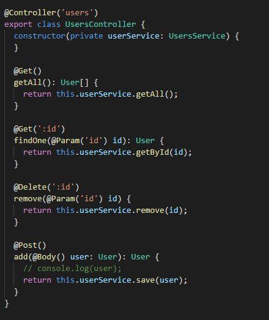
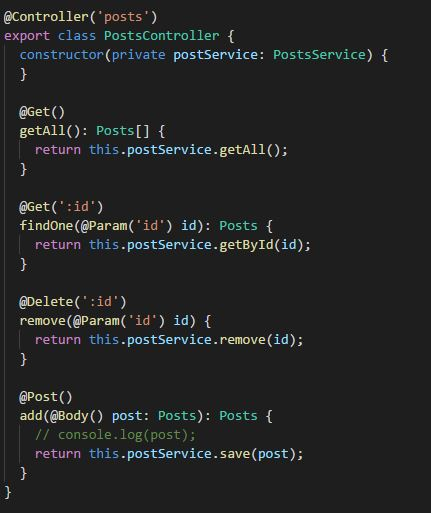
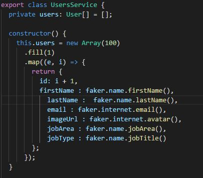
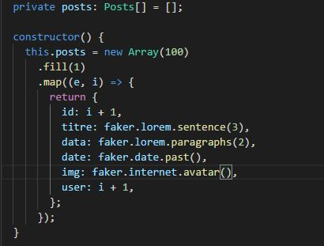
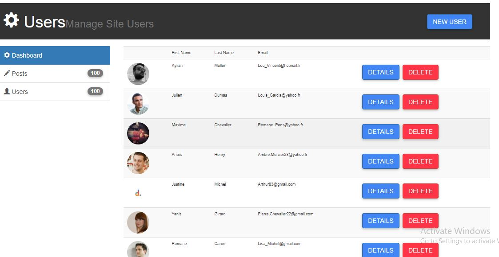
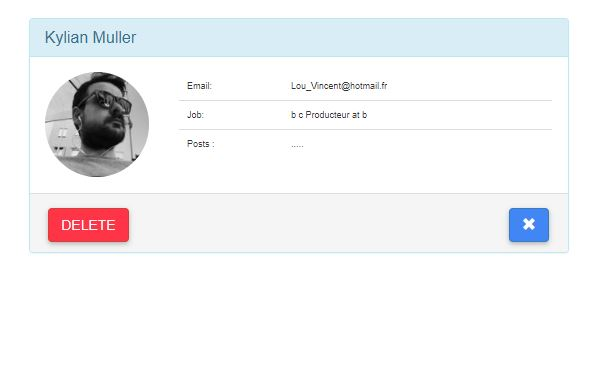
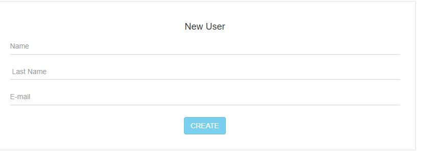
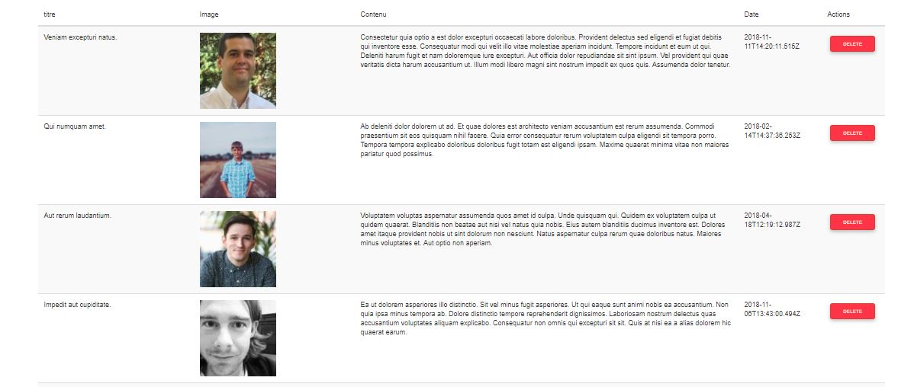

# nest-angular-blog
# The HTTP Requests for The Users :

# The HTTP Requests for The Posts :

Fetching Data Using Faker Data Base : 
users: 
 
posts: 
 

# The Users Component :
the users component contains userDetailComponent and addUserComponent and usersComponent  

The List of users :
 
 

The User Detail :
 
 
 
add User 
 
 

# The Forms Component :
 contains The list of forms :
  
  
 
 

